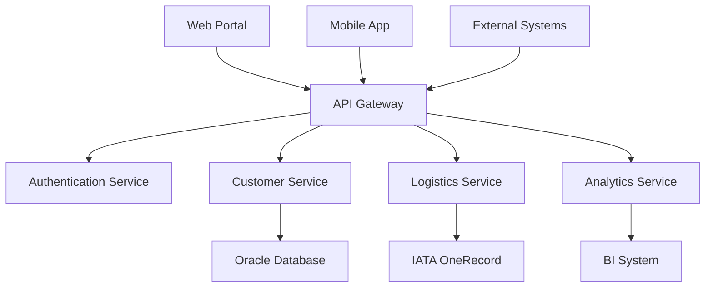

# Customer Online Portal Documentation

Welcome to the **ALSC Logistics Customer Online Portal** documentation. This comprehensive guide covers all aspects of the portal development project, from initial requirements to deployment guidelines.

## 🚀 Project Overview

The Customer Online Portal is a digital platform designed to serve both external customers (Forwarders, Carriers, Individual customers) and internal employees (Sales, Operations, Management teams) of ALSC Logistics.

### Key Features

- **Online Service Delivery**: Registration, service requests, queue management
- **Customer Support**: Multi-channel support with FAQ, ticketing, and live chat
- **Industry-Specific Functions**: Track & trace, flight schedules, analytics
- **Advanced Capabilities**: OCR processing, online payments, AI chatbot

## 📋 Quick Navigation

### For Project Managers
- [Project Backlog](backlog/overview.md) - Complete feature backlog
- [User Stories](backlog/user-stories.md) - Complete user story collection

### For Developers  
- [User Stories](backlog/user-stories.md) - Development requirements

### For Business Analysts
- [User Stories](backlog/user-stories.md) - Complete user story collection
- [Backlog Overview](backlog/overview.md) - Project overview and planning

## 🏗️ Architecture Highlights

## 📊 Development Progress

| Sprint | Phase | Status | Features |
|--------|-------|--------|----------|
| Sprint 0 | Foundation | 📋 Planned | Requirements & Analysis |
| Sprint 1 | Tech Foundation | 📋 Planned | Authentication, RBAC |
| Sprint 2A | MVP1 | 📋 Planned | Registration, Service Requests |
| Sprint 2B | MVP2 | 📋 Planned | Customer Support |
| Sprint 3 | MVP3 | 📋 Planned | Track & Trace, Analytics |
| Sprint 4 | MVP4 | 📋 Planned | Advanced Features |

## 🔐 Security Framework

The portal implements **Zero Trust Architecture** with:

- Multi-factor authentication
- Role-based access control (RBAC)
- OWASP API Security Top 10 compliance
- End-to-end encryption
- Real-time threat monitoring

## 🌐 Integration Ecosystem

### Internal Systems
- **CMS**: Content Management System
- **SAP**: ERP Integration
- **BI**: Business Intelligence Platform
- **Queue Management**: Digital queuing system

### External Systems  
- **IATA OneRecord**: Industry standard integration
- **Airlines**: Flight data and bookings
- **Customs**: Regulatory compliance
- **Ground Handling**: Operational data

## 📱 Multi-Platform Support

- **Web Portal**: Responsive design for desktop and tablet
- **Mobile App**: Native iOS and Android applications
- **API Access**: RESTful APIs for third-party integrations
- **Email/SMS**: Automated notifications

## 🎯 Success Metrics

### Customer Experience
- Customer satisfaction score > 4.0/5.0
- Self-service adoption rate > 70%
- Support ticket resolution < 24 hours

### Operational Efficiency
- Service processing time reduction > 50%
- Manual data entry reduction > 80%
- Support call volume reduction > 30%

## 📚 Documentation Structure

This documentation is organized into the following sections:

- **Project Overview**: High-level project information and architecture
- **Requirements**: Detailed business and technical requirements
- **Product Backlog**: Sprint planning and feature prioritization
- **User Stories**: Detailed user stories for each sprint
- **Technical Documentation**: API specs, database design, integrations
- **Development Guide**: Setup, standards, testing, and deployment

## 🔗 Quick Links

- [Complete User Stories](backlog/user-stories.md) - All 24 user stories across 4 sprints
- [Project Backlog](backlog/overview.md) - Detailed project planning and requirements

---

**Last Updated**: August 2025  
**Version**: 1.0  
**Project Phase**: Planning & Design