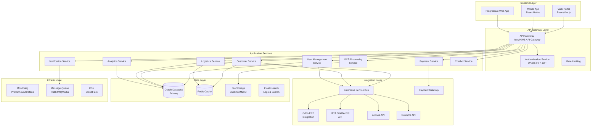
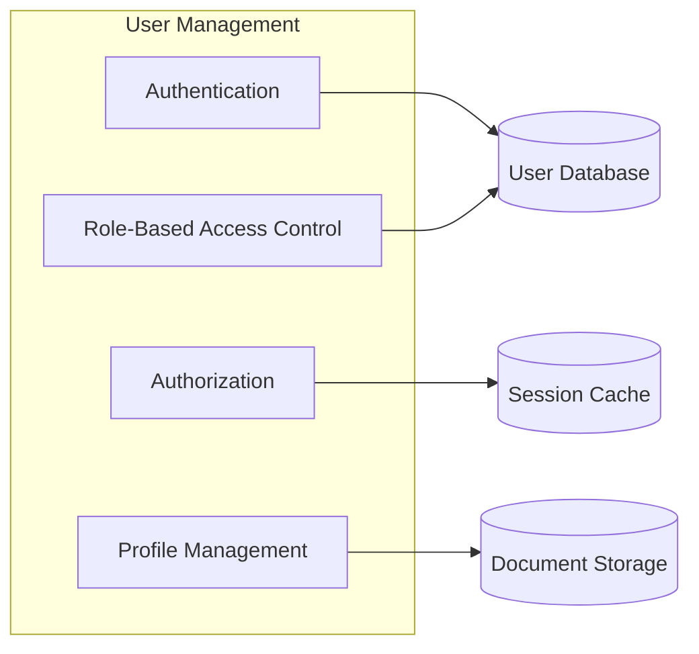
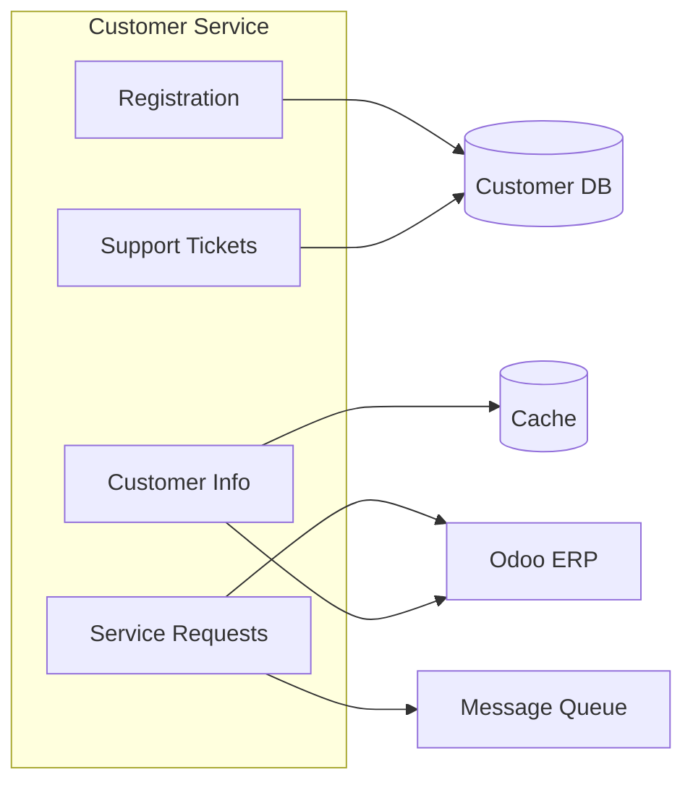
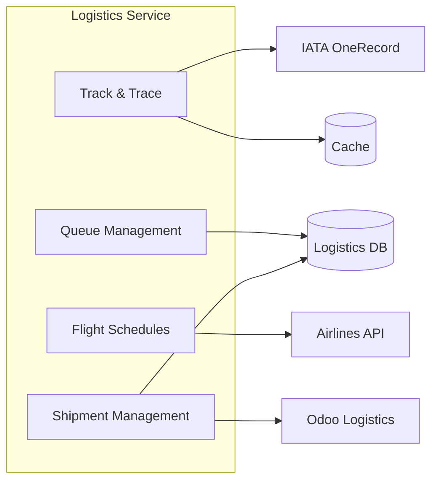
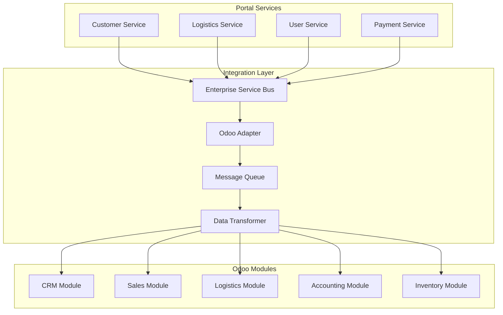
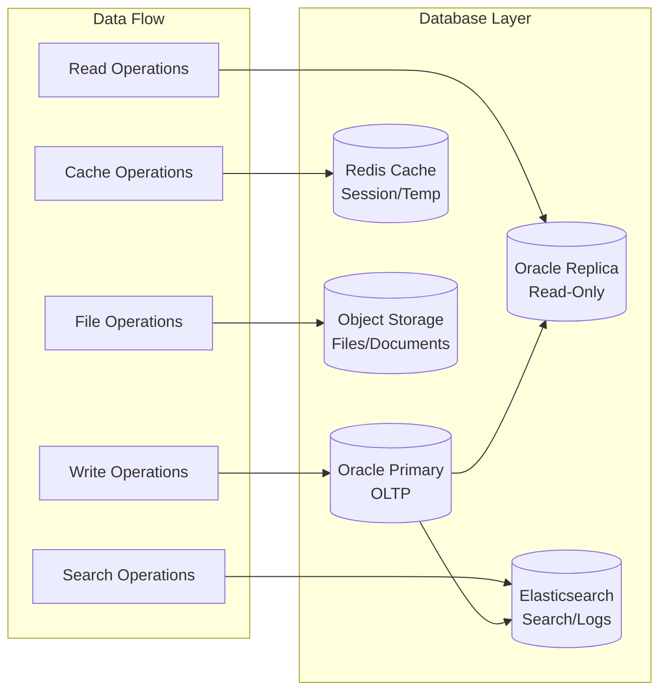
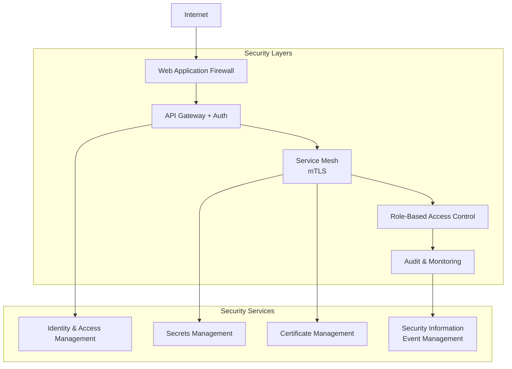
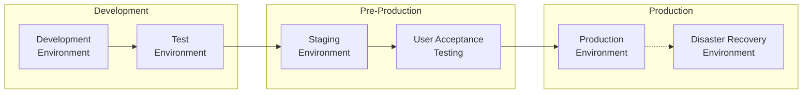
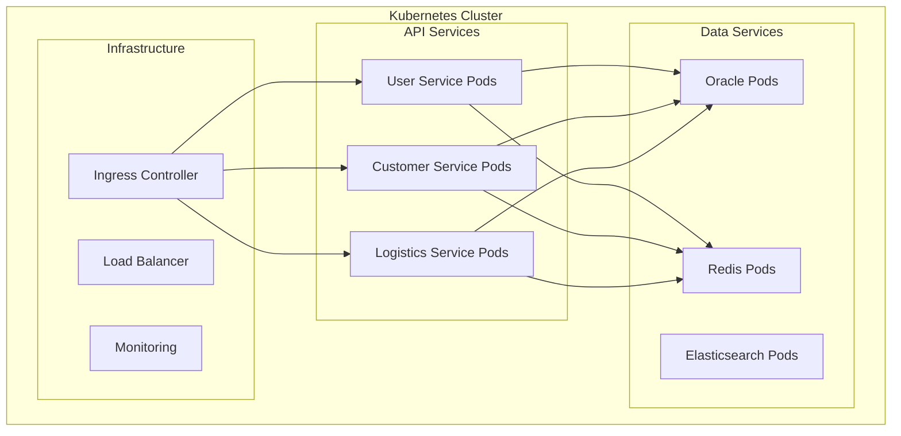
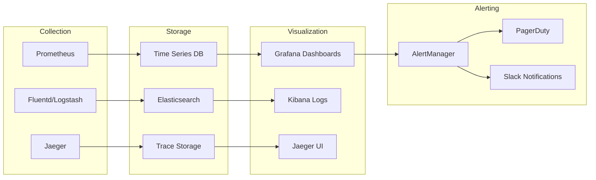

# System Architecture Overview

## Architecture Vision

The Customer Online Portal follows a **microservices architecture** with **Zero Trust security principles**, designed for scalability, reliability, and seamless integration with existing enterprise systems and external logistics partners.

## High-Level Architecture

## Architecture Principles

### 1. Zero Trust Security
- **Never trust, always verify**: Every request is authenticated and authorized
- **Least privilege access**: Users and services have minimal required permissions  
- **Continuous monitoring**: All activities are logged and monitored
- **End-to-end encryption**: Data encrypted in transit and at rest

### 2. Microservices Design
- **Single responsibility**: Each service has one business function
- **Autonomous teams**: Services can be developed and deployed independently
- **Technology diversity**: Choose best technology for each service
- **Fault isolation**: Service failures don't cascade

### 3. API-First Approach
- **OpenAPI specification**: All APIs documented with OpenAPI 3.0
- **Versioning strategy**: Backward-compatible API evolution
- **Consistent patterns**: Standardized request/response formats
- **Rate limiting**: Protect services from abuse

### 4. Cloud-Native
- **Containerization**: Docker containers for all services
- **Orchestration**: Kubernetes for container management
- **Auto-scaling**: Horizontal scaling based on demand
- **Infrastructure as Code**: Terraform for provisioning

## Core Services Architecture

### User Management Service

**Responsibilities:**
- User authentication (OAuth 2.0, SAML)
- Multi-factor authentication
- Role and permission management
- User profile and preference management
- Session management
- Audit logging

### Customer Service

**Responsibilities:**
- Customer registration and onboarding
- Customer information management
- Service request processing
- Support ticket management
- Customer communication
- Integration with Odoo CRM

### Logistics Service

**Responsibilities:**
- Real-time shipment tracking
- Digital queue management
- Flight schedule integration
- Shipment lifecycle management
- Integration with IATA OneRecord
- Odoo logistics module integration

## Integration Architecture

### Odoo ERP Integration

### External Integrations

| System | Protocol | Data Format | Frequency | Purpose |
|--------|----------|-------------|-----------|---------|
| IATA OneRecord | REST API | JSON-LD | Real-time | Shipment tracking |
| Airlines | REST/SOAP | XML/JSON | Real-time | Flight schedules |
| Customs | EDI/API | EDIFACT/JSON | Batch/Real-time | Customs clearance |
| Payment Gateway | REST API | JSON | Real-time | Payment processing |
| SMS/Email | REST API | JSON | Real-time | Notifications |
| OCR Service | REST API | JSON | Real-time | Document processing |

## Data Architecture

### Database Design Strategy

### Data Consistency Strategy
- **ACID compliance** for critical transactions (payments, bookings)
- **Eventual consistency** for analytics and reporting
- **Event sourcing** for audit trails and state reconstruction
- **CQRS pattern** for separating read and write operations

## Security Architecture

### Zero Trust Implementation

### Security Controls

| Layer | Controls | Implementation |
|-------|----------|----------------|
| Network | DDoS protection, WAF | CloudFlare, AWS Shield |
| Application | OWASP Top 10, Input validation | Security middleware |
| API | Rate limiting, OAuth 2.0 | API Gateway, JWT |
| Data | Encryption at rest/transit | TLS 1.3, AES-256 |
| Infrastructure | Container security, secrets | Kubernetes, Vault |

## Deployment Architecture

### Environment Strategy

### Container Orchestration

## Performance & Scalability

### Scaling Strategy

| Component | Scaling Type | Trigger | Target |
|-----------|--------------|---------|--------|
| Web Services | Horizontal | CPU > 70% | 2-10 instances |
| Database | Vertical + Read Replicas | Connection pool > 80% | Up to 16 vCPU |
| Cache | Horizontal | Memory > 80% | 2-5 nodes |
| File Storage | Auto | Storage > 80% | Unlimited |

### Performance Targets

| Metric | Target | Measurement |
|--------|--------|-------------|
| Response Time | < 2 seconds | 95th percentile |
| Throughput | 1000 req/sec | Peak load |
| Availability | 99.9% | Monthly uptime |
| Database Query | < 100ms | Average response |
| File Upload | < 30 seconds | 10MB files |

## Monitoring & Observability

### Monitoring Stack

### Key Metrics

| Category | Metrics | Alerting Threshold |
|----------|---------|-------------------|
| Application | Response time, Error rate, Throughput | > 2s, > 5%, < 100 req/s |
| Infrastructure | CPU, Memory, Disk, Network | > 80%, > 85%, > 90%, > 80% |
| Business | Registration rate, Service requests, Customer satisfaction | < 10/day, > 100 pending, < 4.0 |
| Security | Failed logins, API abuse, Suspicious activity | > 10/min, > 1000/min, Any |

## Technology Stack

### Frontend Technologies
- **Web Framework**: React 18+ with TypeScript
- **Mobile**: React Native for iOS/Android
- **PWA**: Progressive Web App capabilities
- **UI Library**: Material-UI or Ant Design
- **State Management**: Redux Toolkit or Zustand
- **Build Tools**: Vite or Next.js

### Backend Technologies
- **Runtime**: Node.js 18+ or Python 3.11+
- **Framework**: Express.js/Fastify or FastAPI/Django
- **API Documentation**: OpenAPI 3.0 with Swagger UI
- **Authentication**: OAuth 2.0, JWT, SAML
- **Message Queue**: RabbitMQ or Apache Kafka
- **Cache**: Redis Cluster

### Database & Storage
- **Primary Database**: Oracle 19c or PostgreSQL 15+
- **Cache**: Redis 7.0+
- **Search**: Elasticsearch 8.0+
- **File Storage**: AWS S3 or MinIO
- **Backup**: Oracle RMAN or pg_dump with S3

### DevOps & Infrastructure
- **Containerization**: Docker + Docker Compose
- **Orchestration**: Kubernetes 1.28+
- **CI/CD**: GitLab CI/CD or GitHub Actions
- **Infrastructure**: Terraform + Ansible
- **Monitoring**: Prometheus + Grafana + ELK Stack
- **Security**: Vault, cert-manager, Falco

## Migration Strategy

### Phase 1: Foundation (Sprint 0-1)
- Setup development environment
- Implement core authentication service
- Setup basic database structure
- Implement API gateway

### Phase 2: Core Services (Sprint 2A-2B)
- Customer management service
- Basic logistics service
- Support system
- Odoo integration setup

### Phase 3: Advanced Features (Sprint 3-4)
- Track & trace integration
- Payment processing
- OCR capabilities
- Analytics and reporting

### Phase 4: Optimization
- Performance tuning
- Security hardening
- Full monitoring implementation
- Disaster recovery setup

## Risk Mitigation

### Technical Risks
| Risk | Impact | Mitigation |
|------|--------|------------|
| Oracle licensing costs | High | Consider PostgreSQL alternative |
| IATA OneRecord complexity | Medium | Early prototype and testing |
| Odoo customization limits | Medium | Detailed gap analysis |
| Performance at scale | High | Load testing and optimization |

### Security Risks
| Risk | Impact | Mitigation |
|------|--------|------------|
| Data breach | Critical | Zero Trust + encryption |
| API abuse | Medium | Rate limiting + monitoring |
| Insider threats | High | RBAC + audit logging |
| Compliance violations | High | Regular security audits |

---

**Next Steps**: Review [Database Design](../technical/database-design.md) for detailed data model and [API Specifications](../technical/api-specs.md) for integration details.