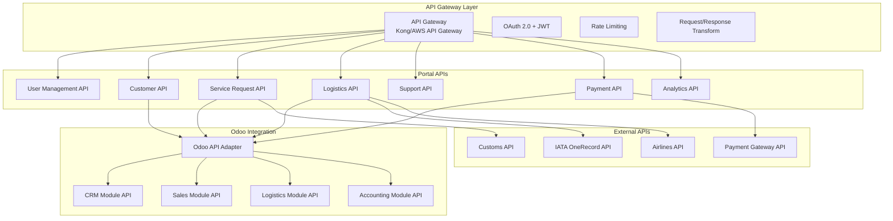
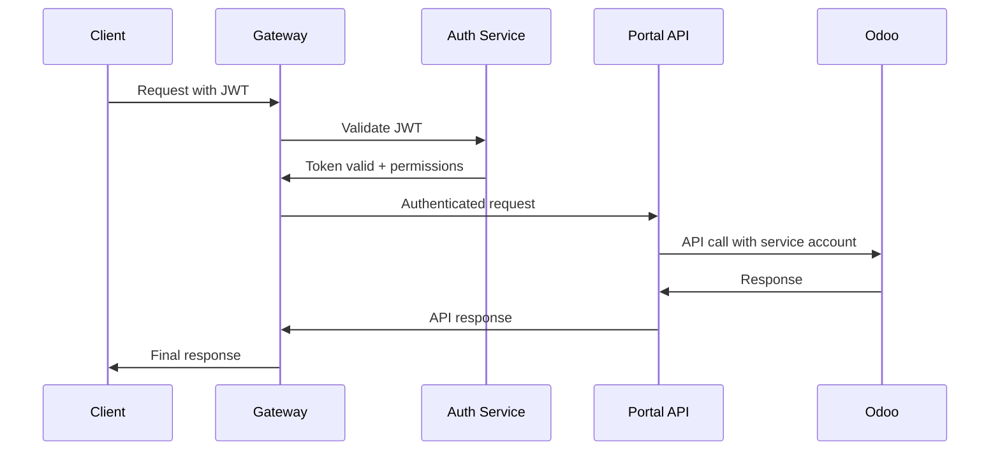
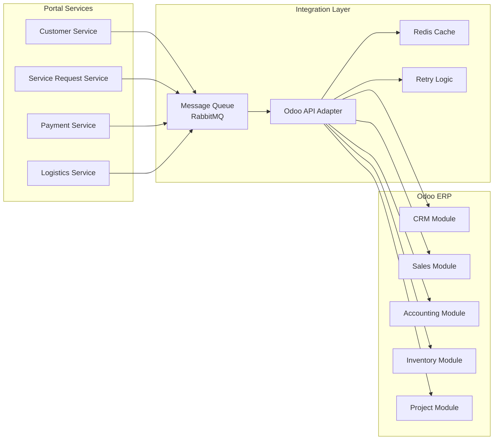

# API Specifications & Odoo Integration

## API Architecture Overview

The Customer Online Portal implements a **RESTful API architecture** with **OpenAPI 3.0** specifications, designed for seamless integration with Odoo ERP and external logistics systems.



## Authentication & Authorization

### JWT Token Structure
```json
{
  "header": {
    "alg": "RS256",
    "typ": "JWT",
    "kid": "portal-key-1"
  },
  "payload": {
    "sub": "user-123e4567-e89b-12d3-a456-426614174000",
    "iss": "alsc-portal",
    "aud": "portal-api",
    "exp": 1735689600,
    "iat": 1735603200,
    "roles": ["CUSTOMER", "PREMIUM_USER"],
    "customer_id": "cust-123e4567-e89b-12d3-a456-426614174000",
    "permissions": ["read:shipments", "create:service_requests"]
  }
}
```

### API Authentication Flow


## Core Portal APIs

### 1. User Management API

#### Authentication Endpoints

**POST /api/v1/auth/login**
```yaml
summary: User login
requestBody:
  required: true
  content:
    application/json:
      schema:
        type: object
        properties:
          username:
            type: string
            example: "john.doe@company.com"
          password:
            type: string
            format: password
          mfa_code:
            type: string
            example: "123456"
        required: [username, password]
responses:
  200:
    description: Login successful
    content:
      application/json:
        schema:
          type: object
          properties:
            access_token:
              type: string
            refresh_token:
              type: string
            expires_in:
              type: integer
              example: 3600
            user:
              $ref: '#/components/schemas/User'
  401:
    description: Invalid credentials
  423:
    description: Account locked
```

**POST /api/v1/auth/refresh**
```yaml
summary: Refresh access token
requestBody:
  required: true
  content:
    application/json:
      schema:
        type: object
        properties:
          refresh_token:
            type: string
        required: [refresh_token]
responses:
  200:
    description: Token refreshed
    content:
      application/json:
        schema:
          type: object
          properties:
            access_token:
              type: string
            expires_in:
              type: integer
```

#### User Profile Endpoints

**GET /api/v1/users/profile**
```yaml
summary: Get current user profile
security:
  - BearerAuth: []
responses:
  200:
    description: User profile
    content:
      application/json:
        schema:
          $ref: '#/components/schemas/UserProfile'
```

**PUT /api/v1/users/profile**
```yaml
summary: Update user profile
security:
  - BearerAuth: []
requestBody:
  required: true
  content:
    application/json:
      schema:
        $ref: '#/components/schemas/UserProfileUpdate'
responses:
  200:
    description: Profile updated
    content:
      application/json:
        schema:
          $ref: '#/components/schemas/UserProfile'
```

### 2. Customer Management API

#### Customer Registration

**POST /api/v1/customers/register**
```yaml
summary: Register new customer
requestBody:
  required: true
  content:
    application/json:
      schema:
        type: object
        properties:
          company_name:
            type: string
            example: "ACME Logistics Ltd"
          business_type:
            type: string
            enum: [FORWARDER, CARRIER, SHIPPER, INDIVIDUAL]
          tax_number:
            type: string
            example: "TAX123456789"
          industry:
            type: string
            example: "Manufacturing"
          primary_contact:
            $ref: '#/components/schemas/ContactInfo'
          billing_address:
            $ref: '#/components/schemas/Address'
          shipping_address:
            $ref: '#/components/schemas/Address'
        required: [company_name, business_type, primary_contact]
responses:
  201:
    description: Customer registered successfully
    content:
      application/json:
        schema:
          type: object
          properties:
            customer_id:
              type: string
              format: uuid
            customer_code:
              type: string
              example: "CUST-2025-001"
            approval_status:
              type: string
              enum: [PENDING, APPROVED, REJECTED]
  400:
    description: Invalid input data
  409:
    description: Customer already exists
```

#### Customer Information

**GET /api/v1/customers/{customer_id}**
```yaml
summary: Get customer details
security:
  - BearerAuth: []
parameters:
  - name: customer_id
    in: path
    required: true
    schema:
      type: string
      format: uuid
responses:
  200:
    description: Customer details
    content:
      application/json:
        schema:
          $ref: '#/components/schemas/Customer'
  404:
    description: Customer not found
```

**PUT /api/v1/customers/{customer_id}**
```yaml
summary: Update customer information
security:
  - BearerAuth: []
parameters:
  - name: customer_id
    in: path
    required: true
    schema:
      type: string
      format: uuid
requestBody:
  required: true
  content:
    application/json:
      schema:
        $ref: '#/components/schemas/CustomerUpdate'
responses:
  200:
    description: Customer updated
    content:
      application/json:
        schema:
          $ref: '#/components/schemas/Customer'
```

### 3. Service Request API

#### Create Service Request

**POST /api/v1/service-requests**
```yaml
summary: Create new service request
security:
  - BearerAuth: []
requestBody:
  required: true
  content:
    application/json:
      schema:
        type: object
        properties:
          service_type_id:
            type: string
            format: uuid
          title:
            type: string
            example: "Air freight shipment to Singapore"
          description:
            type: string
          priority:
            type: string
            enum: [LOW, MEDIUM, HIGH, URGENT]
            default: MEDIUM
          requested_date:
            type: string
            format: date
          shipment_details:
            $ref: '#/components/schemas/ShipmentDetails'
          documents:
            type: array
            items:
              $ref: '#/components/schemas/DocumentUpload'
        required: [service_type_id, title, requested_date]
responses:
  201:
    description: Service request created
    content:
      application/json:
        schema:
          type: object
          properties:
            request_id:
              type: string
              format: uuid
            request_number:
              type: string
              example: "SR-2025-001234"
            status:
              type: string
              enum: [DRAFT, SUBMITTED, IN_REVIEW, APPROVED, IN_PROGRESS, COMPLETED, CANCELLED]
            estimated_cost:
              type: number
              format: decimal
            currency:
              type: string
              example: "USD"
```

#### Service Request Status

**GET /api/v1/service-requests/{request_id}/status**
```yaml
summary: Get service request status
security:
  - BearerAuth: []
parameters:
  - name: request_id
    in: path
    required: true
    schema:
      type: string
      format: uuid
responses:
  200:
    description: Service request status
    content:
      application/json:
        schema:
          type: object
          properties:
            request_id:
              type: string
              format: uuid
            status:
              type: string
            status_history:
              type: array
              items:
                type: object
                properties:
                  status:
                    type: string
                  timestamp:
                    type: string
                    format: date-time
                  updated_by:
                    type: string
                  notes:
                    type: string
```

### 4. Logistics & Tracking API

#### Track Shipment

**GET /api/v1/shipments/{shipment_id}/tracking**
```yaml
summary: Get shipment tracking information
security:
  - BearerAuth: []
parameters:
  - name: shipment_id
    in: path
    required: true
    schema:
      type: string
      format: uuid
  - name: include_history
    in: query
    schema:
      type: boolean
      default: true
responses:
  200:
    description: Tracking information
    content:
      application/json:
        schema:
          type: object
          properties:
            shipment_id:
              type: string
              format: uuid
            awb_number:
              type: string
              example: "125-12345678"
            current_status:
              type: string
              enum: [CREATED, BOOKED, MANIFESTED, DEPARTED, IN_TRANSIT, ARRIVED, CUSTOMS_CLEARANCE, DELIVERED]
            current_location:
              type: string
            estimated_delivery:
              type: string
              format: date-time
            tracking_events:
              type: array
              items:
                $ref: '#/components/schemas/TrackingEvent'
```

**GET /api/v1/tracking/awb/{awb_number}**
```yaml
summary: Track by AWB number (public endpoint with rate limiting)
parameters:
  - name: awb_number
    in: path
    required: true
    schema:
      type: string
      pattern: '^[0-9]{3}-[0-9]{8}$'
responses:
  200:
    description: Public tracking information
    content:
      application/json:
        schema:
          type: object
          properties:
            awb_number:
              type: string
            status:
              type: string
            origin:
              type: string
            destination:
              type: string
            estimated_delivery:
              type: string
              format: date-time
            latest_event:
              $ref: '#/components/schemas/TrackingEvent'
```

#### Flight Schedules

**GET /api/v1/flights/schedules**
```yaml
summary: Get flight schedules
security:
  - BearerAuth: []
parameters:
  - name: origin
    in: query
    required: true
    schema:
      type: string
      pattern: '^[A-Z]{3}$'
  - name: destination
    in: query
    required: true
    schema:
      type: string
      pattern: '^[A-Z]{3}$'
  - name: date
    in: query
    required: true
    schema:
      type: string
      format: date
  - name: airline
    in: query
    schema:
      type: string
      pattern: '^[A-Z]{2}$'
responses:
  200:
    description: Flight schedules
    content:
      application/json:
        schema:
          type: object
          properties:
            flights:
              type: array
              items:
                $ref: '#/components/schemas/FlightSchedule'
            total_count:
              type: integer
```

### 5. Support Ticket API

#### Create Support Ticket

**POST /api/v1/support/tickets**
```yaml
summary: Create support ticket
security:
  - BearerAuth: []
requestBody:
  required: true
  content:
    application/json:
      schema:
        type: object
        properties:
          subject:
            type: string
            maxLength: 200
          description:
            type: string
          category:
            type: string
            enum: [TECHNICAL, BILLING, SHIPMENT, GENERAL]
          priority:
            type: string
            enum: [LOW, MEDIUM, HIGH, URGENT]
            default: MEDIUM
          attachments:
            type: array
            items:
              $ref: '#/components/schemas/AttachmentUpload'
        required: [subject, description, category]
responses:
  201:
    description: Ticket created
    content:
      application/json:
        schema:
          type: object
          properties:
            ticket_id:
              type: string
              format: uuid
            ticket_number:
              type: string
              example: "TK-2025-001234"
            status:
              type: string
              default: OPEN
            sla_due_date:
              type: string
              format: date-time
```

## Odoo ERP Integration APIs

### Integration Architecture



### Odoo API Adapter Specifications

#### Customer Synchronization

**POST /api/v1/odoo/customers/sync**
```yaml
summary: Sync customer data to Odoo CRM
security:
  - ServiceAuth: []
requestBody:
  required: true
  content:
    application/json:
      schema:
        type: object
        properties:
          action:
            type: string
            enum: [CREATE, UPDATE, DELETE]
          customer_data:
            type: object
            properties:
              customer_id:
                type: string
                format: uuid
              name:
                type: string
              email:
                type: string
              phone:
                type: string
              company_name:
                type: string
              tax_number:
                type: string
              category:
                type: string
              addresses:
                type: array
                items:
                  $ref: '#/components/schemas/Address'
          odoo_customer_id:
            type: integer
            description: "Odoo partner ID (for updates)"
responses:
  200:
    description: Sync successful
    content:
      application/json:
        schema:
          type: object
          properties:
            success:
              type: boolean
            odoo_customer_id:
              type: integer
            sync_timestamp:
              type: string
              format: date-time
  400:
    description: Invalid data
  500:
    description: Odoo API error
```

#### Service Request to Sales Order

**POST /api/v1/odoo/sales-orders/create**
```yaml
summary: Create Odoo sales order from service request
security:
  - ServiceAuth: []
requestBody:
  required: true
  content:
    application/json:
      schema:
        type: object
        properties:
          service_request_id:
            type: string
            format: uuid
          odoo_customer_id:
            type: integer
          order_lines:
            type: array
            items:
              type: object
              properties:
                product_id:
                  type: integer
                quantity:
                  type: number
                  format: decimal
                price_unit:
                  type: number
                  format: decimal
                description:
                  type: string
          shipment_details:
            type: object
            properties:
              origin:
                type: string
              destination:
                type: string
              weight:
                type: number
              pieces:
                type: integer
              commodity:
                type: string
responses:
  201:
    description: Sales order created
    content:
      application/json:
        schema:
          type: object
          properties:
            odoo_order_id:
              type: integer
            order_name:
              type: string
            state:
              type: string
            amount_total:
              type: number
              format: decimal
```

#### Invoice Management

**GET /api/v1/odoo/invoices/{customer_id}**
```yaml
summary: Get customer invoices from Odoo
security:
  - ServiceAuth: []
parameters:
  - name: customer_id
    in: path
    required: true
    schema:
      type: string
      format: uuid
  - name: status
    in: query
    schema:
      type: string
      enum: [draft, open, paid, cancelled]
  - name: date_from
    in: query
    schema:
      type: string
      format: date
  - name: date_to
    in: query
    schema:
      type: string
      format: date
responses:
  200:
    description: Invoice list
    content:
      application/json:
        schema:
          type: object
          properties:
            invoices:
              type: array
              items:
                type: object
                properties:
                  invoice_id:
                    type: integer
                  number:
                    type: string
                  date_invoice:
                    type: string
                    format: date
                  due_date:
                    type: string
                    format: date
                  amount_total:
                    type: number
                    format: decimal
                  amount_due:
                    type: number
                    format: decimal
                  state:
                    type: string
                  currency:
                    type: string
```

#### Inventory Integration

**GET /api/v1/odoo/inventory/availability**
```yaml
summary: Check product/service availability
security:
  - ServiceAuth: []
parameters:
  - name: product_ids
    in: query
    required: true
    schema:
      type: array
      items:
        type: integer
    style: form
    explode: false
  - name: location
    in: query
    schema:
      type: string
responses:
  200:
    description: Availability information
    content:
      application/json:
        schema:
          type: object
          properties:
            products:
              type: array
              items:
                type: object
                properties:
                  product_id:
                    type: integer
                  name:
                    type: string
                  available_quantity:
                    type: number
                    format: decimal
                  reserved_quantity:
                    type: number
                    format: decimal
                  unit_of_measure:
                    type: string
```

### Data Mapping & Transformation

#### Customer Data Mapping
| Portal Field | Odoo Field | Transformation |
|--------------|------------|----------------|
| customer_id | x_portal_customer_id | Direct mapping |
| company_name | name | Direct mapping |
| customer_code | ref | Direct mapping |
| tax_number | vat | Direct mapping |
| customer_tier | category_id | Map to Odoo categories |
| credit_limit | credit_limit | Direct mapping |
| billing_address | invoice_address | Address object transformation |
| shipping_address | delivery_address | Address object transformation |

#### Service Request to Sales Order Mapping
| Portal Field | Odoo Field | Transformation |
|--------------|------------|----------------|
| request_id | x_portal_request_id | Direct mapping |
| customer_id | partner_id | Lookup Odoo partner ID |
| service_type | product_id | Map to Odoo products |
| description | note | Direct mapping |
| estimated_cost | amount_total | Calculate from order lines |
| requested_date | date_order | Direct mapping |

### Error Handling & Retry Logic

#### Retry Configuration
```yaml
retry_policy:
  max_attempts: 3
  backoff_strategy: exponential
  initial_delay: 1000ms
  max_delay: 30000ms
  retry_conditions:
    - connection_timeout
    - server_error_5xx
    - rate_limit_exceeded
  
non_retryable_errors:
  - authentication_failed
  - invalid_data_format
  - resource_not_found
```

#### Error Response Format
```json
{
  "error": {
    "code": "ODOO_CONNECTION_FAILED",
    "message": "Unable to connect to Odoo server",
    "details": {
      "odoo_endpoint": "https://odoo.alsc.com/api/v1",
      "timestamp": "2025-08-05T14:30:00Z",
      "retry_after": 30
    },
    "request_id": "req-123e4567-e89b-12d3-a456-426614174000"
  }
}
```

## External API Integrations

### IATA OneRecord Integration

#### Track Shipment via OneRecord

**GET /api/v1/iata/logistics-objects/{awb_number}**
```yaml
summary: Get shipment data from IATA OneRecord
security:
  - ServiceAuth: []
parameters:
  - name: awb_number
    in: path
    required: true
    schema:
      type: string
responses:
  200:
    description: OneRecord logistics object
    content:
      application/json:
        schema:
          type: object
          properties:
            '@context':
              type: string
            '@type':
              type: string
              example: "Shipment"
            waybillNumber:
              type: string
            origin:
              $ref: '#/components/schemas/Location'
            destination:
              $ref: '#/components/schemas/Location'
            pieces:
              type: array
              items:
                $ref: '#/components/schemas/Piece'
            events:
              type: array
              items:
                $ref: '#/components/schemas/LogisticsEvent'
```

### Payment Gateway Integration

#### Process Payment

**POST /api/v1/payments/process**
```yaml
summary: Process payment via gateway
security:
  - BearerAuth: []
requestBody:
  required: true
  content:
    application/json:
      schema:
        type: object
        properties:
          amount:
            type: number
            format: decimal
          currency:
            type: string
            example: "USD"
          payment_method:
            type: object
            properties:
              type:
                type: string
                enum: [CREDIT_CARD, BANK_TRANSFER, DIGITAL_WALLET]
              card_token:
                type: string
              bank_account:
                type: string
          service_request_id:
            type: string
            format: uuid
          description:
            type: string
responses:
  200:
    description: Payment processed
    content:
      application/json:
        schema:
          type: object
          properties:
            payment_id:
              type: string
              format: uuid
            transaction_id:
              type: string
            status:
              type: string
              enum: [COMPLETED, FAILED, PENDING]
            gateway_response:
              type: object
```

## Data Models & Schemas

### Core Schemas

#### User Schema
```yaml
User:
  type: object
  properties:
    user_id:
      type: string
      format: uuid
    username:
      type: string
    email:
      type: string
      format: email
    first_name:
      type: string
    last_name:
      type: string
    user_type:
      type: string
      enum: [CUSTOMER, EMPLOYEE, ADMIN]
    status:
      type: string
      enum: [ACTIVE, INACTIVE, SUSPENDED]
    roles:
      type: array
      items:
        type: string
    created_at:
      type: string
      format: date-time
    last_login_at:
      type: string
      format: date-time
```

#### Customer Schema
```yaml
Customer:
  type: object
  properties:
    customer_id:
      type: string
      format: uuid
    customer_code:
      type: string
    company_name:
      type: string
    business_type:
      type: string
      enum: [FORWARDER, CARRIER, SHIPPER, INDIVIDUAL]
    tax_number:
      type: string
    industry:
      type: string
    customer_tier:
      type: string
      enum: [PREMIUM, STANDARD, BASIC]
    credit_limit:
      type: number
      format: decimal
    payment_terms:
      type: integer
    status:
      type: string
      enum: [ACTIVE, INACTIVE, SUSPENDED]
    contacts:
      type: array
      items:
        $ref: '#/components/schemas/ContactInfo'
    addresses:
      type: array
      items:
        $ref: '#/components/schemas/Address'
```

#### Service Request Schema
```yaml
ServiceRequest:
  type: object
  properties:
    request_id:
      type: string
      format: uuid
    request_number:
      type: string
    customer_id:
      type: string
      format: uuid
    service_type:
      type: string
    title:
      type: string
    description:
      type: string
    priority:
      type: string
      enum: [LOW, MEDIUM, HIGH, URGENT]
    status:
      type: string
      enum: [DRAFT, SUBMITTED, IN_REVIEW, APPROVED, IN_PROGRESS, COMPLETED, CANCELLED, REJECTED]
    estimated_cost:
      type: number
      format: decimal
    actual_cost:
      type: number
      format: decimal
    currency:
      type: string
    requested_date:
      type: string
      format: date
    expected_completion_date:
      type: string
      format: date
    shipment_details:
      $ref: '#/components/schemas/ShipmentDetails'
    documents:
      type: array
      items:
        $ref: '#/components/schemas/Document'
    created_at:
      type: string
      format: date-time
    updated_at:
      type: string
      format: date-time
```

## API Rate Limiting & Throttling

### Rate Limit Configuration
| API Endpoint | Rate Limit | Window | Burst |
|--------------|------------|--------|-------|
| /api/v1/auth/* | 10/min | 1 minute | 15 |
| /api/v1/tracking/awb/* | 100/hour | 1 hour | 20 |
| /api/v1/customers/* | 1000/hour | 1 hour | 50 |
| /api/v1/service-requests/* | 500/hour | 1 hour | 25 |
| /api/v1/payments/* | 100/hour | 1 hour | 10 |

### Throttling Response
```json
{
  "error": {
    "code": "RATE_LIMIT_EXCEEDED",
    "message": "API rate limit exceeded",
    "retry_after": 60,
    "limit": 100,
    "remaining": 0,
    "reset": 1735689600
  }
}
```

## API Monitoring & Analytics

### Key Metrics
- Request/response times (p50, p95, p99)
- Error rates by endpoint
- Authentication failures
- Rate limit violations
- Integration failures (Odoo, external APIs)
- Data consistency checks

### Health Check Endpoints

**GET /api/v1/health**
```yaml
summary: System health check
responses:
  200:
    description: System healthy
    content:
      application/json:
        schema:
          type: object
          properties:
            status:
              type: string
              example: "healthy"
            timestamp:
              type: string
              format: date-time
            services:
              type: object
              properties:
                database:
                  type: string
                  example: "healthy"
                redis:
                  type: string
                  example: "healthy"
                odoo:
                  type: string
                  example: "degraded"
                iata_onerecord:
                  type: string
                  example: "healthy"
```

---

**Next Steps**: Review [Odoo Fit & Gap Analysis](odoo-fit-gap.md) for detailed ERP integration planning and requirements mapping.