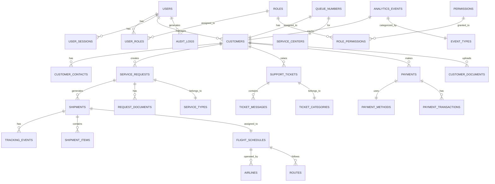

# Database Design & Entity Relationship Model

## Database Strategy

The Customer Online Portal uses **Oracle Database 19c** as the primary OLTP system with the following architectural components:

- **Primary Database**: Oracle 19c for transactional operations
- **Read Replicas**: For read-heavy operations and reporting
- **Redis Cache**: For session management and temporary data
- **Elasticsearch**: For full-text search and analytics

## Entity Relationship Diagram



## Core Tables

### User Management

#### USERS
```sql
CREATE TABLE users (
    user_id VARCHAR2(36) PRIMARY KEY,
    username VARCHAR2(100) UNIQUE NOT NULL,
    email VARCHAR2(255) UNIQUE NOT NULL,
    password_hash VARCHAR2(255) NOT NULL,
    first_name VARCHAR2(100) NOT NULL,
    last_name VARCHAR2(100) NOT NULL,
    phone_number VARCHAR2(20),
    user_type VARCHAR2(20) CHECK (user_type IN ('CUSTOMER', 'EMPLOYEE', 'ADMIN')),
    status VARCHAR2(20) DEFAULT 'ACTIVE' CHECK (status IN ('ACTIVE', 'INACTIVE', 'SUSPENDED', 'PENDING')),
    email_verified NUMBER(1) DEFAULT 0,
    phone_verified NUMBER(1) DEFAULT 0,
    mfa_enabled NUMBER(1) DEFAULT 0,
    mfa_secret VARCHAR2(32),
    password_expires_at TIMESTAMP,
    last_login_at TIMESTAMP,
    failed_login_attempts NUMBER(3) DEFAULT 0,
    locked_until TIMESTAMP,
    created_at TIMESTAMP DEFAULT CURRENT_TIMESTAMP,
    updated_at TIMESTAMP DEFAULT CURRENT_TIMESTAMP,
    created_by VARCHAR2(36),
    updated_by VARCHAR2(36)
);

CREATE INDEX idx_users_email ON users(email);
CREATE INDEX idx_users_username ON users(username);
CREATE INDEX idx_users_type_status ON users(user_type, status);
```

#### ROLES
```sql
CREATE TABLE roles (
    role_id VARCHAR2(36) PRIMARY KEY,
    role_name VARCHAR2(100) UNIQUE NOT NULL,
    role_description VARCHAR2(500),
    role_level NUMBER(2) DEFAULT 1,
    is_system_role NUMBER(1) DEFAULT 0,
    status VARCHAR2(20) DEFAULT 'ACTIVE',
    created_at TIMESTAMP DEFAULT CURRENT_TIMESTAMP,
    updated_at TIMESTAMP DEFAULT CURRENT_TIMESTAMP
);

-- System roles
INSERT INTO roles VALUES ('role-admin', 'SYSTEM_ADMIN', 'System Administrator', 10, 1, 'ACTIVE', SYSDATE, SYSDATE);
INSERT INTO roles VALUES ('role-manager', 'MANAGER', 'Department Manager', 8, 1, 'ACTIVE', SYSDATE, SYSDATE);
INSERT INTO roles VALUES ('role-employee', 'EMPLOYEE', 'Employee', 5, 1, 'ACTIVE', SYSDATE, SYSDATE);
INSERT INTO roles VALUES ('role-customer', 'CUSTOMER', 'External Customer', 1, 1, 'ACTIVE', SYSDATE, SYSDATE);
```

#### USER_ROLES
```sql
CREATE TABLE user_roles (
    user_role_id VARCHAR2(36) PRIMARY KEY,
    user_id VARCHAR2(36) NOT NULL,
    role_id VARCHAR2(36) NOT NULL,
    assigned_at TIMESTAMP DEFAULT CURRENT_TIMESTAMP,
    assigned_by VARCHAR2(36),
    expires_at TIMESTAMP,
    status VARCHAR2(20) DEFAULT 'ACTIVE',
    FOREIGN KEY (user_id) REFERENCES users(user_id),
    FOREIGN KEY (role_id) REFERENCES roles(role_id),
    UNIQUE(user_id, role_id)
);
```

### Customer Management

#### CUSTOMERS
```sql
CREATE TABLE customers (
    customer_id VARCHAR2(36) PRIMARY KEY,
    user_id VARCHAR2(36) UNIQUE,
    customer_code VARCHAR2(50) UNIQUE NOT NULL,
    company_name VARCHAR2(200),
    business_type VARCHAR2(50),
    tax_number VARCHAR2(50),
    industry VARCHAR2(100),
    customer_tier VARCHAR2(20) DEFAULT 'STANDARD' CHECK (customer_tier IN ('PREMIUM', 'STANDARD', 'BASIC')),
    credit_limit NUMBER(15,2) DEFAULT 0,
    payment_terms NUMBER(3) DEFAULT 30,
    billing_address_id VARCHAR2(36),
    shipping_address_id VARCHAR2(36),
    primary_contact_id VARCHAR2(36),
    account_manager_id VARCHAR2(36),
    status VARCHAR2(20) DEFAULT 'ACTIVE',
    registration_date DATE DEFAULT SYSDATE,
    approval_status VARCHAR2(20) DEFAULT 'PENDING' CHECK (approval_status IN ('PENDING', 'APPROVED', 'REJECTED')),
    approved_by VARCHAR2(36),
    approved_at TIMESTAMP,
    notes CLOB,
    created_at TIMESTAMP DEFAULT CURRENT_TIMESTAMP,
    updated_at TIMESTAMP DEFAULT CURRENT_TIMESTAMP,
    FOREIGN KEY (user_id) REFERENCES users(user_id),
    FOREIGN KEY (account_manager_id) REFERENCES users(user_id)
);

CREATE INDEX idx_customers_code ON customers(customer_code);
CREATE INDEX idx_customers_status ON customers(status);
CREATE INDEX idx_customers_tier ON customers(customer_tier);
```

#### CUSTOMER_CONTACTS
```sql
CREATE TABLE customer_contacts (
    contact_id VARCHAR2(36) PRIMARY KEY,
    customer_id VARCHAR2(36) NOT NULL,
    contact_type VARCHAR2(30) CHECK (contact_type IN ('PRIMARY', 'BILLING', 'SHIPPING', 'TECHNICAL', 'EMERGENCY')),
    first_name VARCHAR2(100) NOT NULL,
    last_name VARCHAR2(100) NOT NULL,
    title VARCHAR2(100),
    department VARCHAR2(100),
    email VARCHAR2(255),
    phone VARCHAR2(20),
    mobile VARCHAR2(20),
    address_line1 VARCHAR2(200),
    address_line2 VARCHAR2(200),
    city VARCHAR2(100),
    state VARCHAR2(100),
    postal_code VARCHAR2(20),
    country VARCHAR2(2),
    is_primary NUMBER(1) DEFAULT 0,
    created_at TIMESTAMP DEFAULT CURRENT_TIMESTAMP,
    updated_at TIMESTAMP DEFAULT CURRENT_TIMESTAMP,
    FOREIGN KEY (customer_id) REFERENCES customers(customer_id)
);

CREATE INDEX idx_customer_contacts_customer ON customer_contacts(customer_id);
CREATE INDEX idx_customer_contacts_type ON customer_contacts(contact_type);
```

### Service Management

#### SERVICE_TYPES
```sql
CREATE TABLE service_types (
    service_type_id VARCHAR2(36) PRIMARY KEY,
    service_code VARCHAR2(20) UNIQUE NOT NULL,
    service_name VARCHAR2(100) NOT NULL,
    service_description VARCHAR2(500),
    service_category VARCHAR2(50),
    base_price NUMBER(10,2),
    currency VARCHAR2(3) DEFAULT 'USD',
    sla_hours NUMBER(3) DEFAULT 24,
    requires_approval NUMBER(1) DEFAULT 0,
    status VARCHAR2(20) DEFAULT 'ACTIVE',
    created_at TIMESTAMP DEFAULT CURRENT_TIMESTAMP,
    updated_at TIMESTAMP DEFAULT CURRENT_TIMESTAMP
);

-- Standard logistics services
INSERT INTO service_types VALUES ('svc-air-freight', 'AIR_FREIGHT', 'Air Freight Service', 'Air cargo transportation', 'FREIGHT', 0, 'USD', 48, 0, 'ACTIVE', SYSDATE, SYSDATE);
INSERT INTO service_types VALUES ('svc-customs', 'CUSTOMS', 'Customs Clearance', 'Import/Export customs processing', 'CUSTOMS', 0, 'USD', 72, 1, 'ACTIVE', SYSDATE, SYSDATE);
INSERT INTO service_types VALUES ('svc-warehouse', 'WAREHOUSE', 'Warehousing Service', 'Cargo storage and handling', 'WAREHOUSE', 0, 'USD', 24, 0, 'ACTIVE', SYSDATE, SYSDATE);
```

#### SERVICE_REQUESTS
```sql
CREATE TABLE service_requests (
    request_id VARCHAR2(36) PRIMARY KEY,
    request_number VARCHAR2(50) UNIQUE NOT NULL,
    customer_id VARCHAR2(36) NOT NULL,
    service_type_id VARCHAR2(36) NOT NULL,
    request_title VARCHAR2(200) NOT NULL,
    request_description CLOB,
    priority VARCHAR2(20) DEFAULT 'MEDIUM' CHECK (priority IN ('LOW', 'MEDIUM', 'HIGH', 'URGENT')),
    status VARCHAR2(30) DEFAULT 'SUBMITTED' CHECK (status IN ('DRAFT', 'SUBMITTED', 'IN_REVIEW', 'APPROVED', 'IN_PROGRESS', 'COMPLETED', 'CANCELLED', 'REJECTED')),
    estimated_cost NUMBER(15,2),
    actual_cost NUMBER(15,2),
    currency VARCHAR2(3) DEFAULT 'USD',
    requested_date DATE,
    expected_completion_date DATE,
    actual_completion_date DATE,
    assigned_to VARCHAR2(36),
    created_by VARCHAR2(36) NOT NULL,
    approved_by VARCHAR2(36),
    approved_at TIMESTAMP,
    completed_by VARCHAR2(36),
    completed_at TIMESTAMP,    
    created_at TIMESTAMP DEFAULT CURRENT_TIMESTAMP,
    updated_at TIMESTAMP DEFAULT CURRENT_TIMESTAMP,
    FOREIGN KEY (customer_id) REFERENCES customers(customer_id),
    FOREIGN KEY (service_type_id) REFERENCES service_types(service_type_id),
    FOREIGN KEY (assigned_to) REFERENCES users(user_id),
    FOREIGN KEY (created_by) REFERENCES users(user_id)
);

CREATE INDEX idx_service_requests_customer ON service_requests(customer_id);
CREATE INDEX idx_service_requests_status ON service_requests(status);
CREATE INDEX idx_service_requests_date ON service_requests(created_at);
```

### Logistics & Shipments

#### SHIPMENTS
```sql
CREATE TABLE shipments (
    shipment_id VARCHAR2(36) PRIMARY KEY,
    awb_number VARCHAR2(50) UNIQUE,
    house_awb VARCHAR2(50),
    service_request_id VARCHAR2(36),
    customer_id VARCHAR2(36) NOT NULL,
    shipper_name VARCHAR2(200),
    shipper_address CLOB,
    consignee_name VARCHAR2(200),
    consignee_address CLOB,
    origin_airport VARCHAR2(3),
    destination_airport VARCHAR2(3),
    transit_airports VARCHAR2(100),
    flight_number VARCHAR2(20),
    flight_date DATE,
    pieces NUMBER(6),
    weight_kg NUMBER(10,3),
    volume_cbm NUMBER(10,3),
    commodity_code VARCHAR2(20),
    commodity_description VARCHAR2(500),
    declared_value NUMBER(15,2),
    currency VARCHAR2(3) DEFAULT 'USD',
    incoterm VARCHAR2(10),
    special_instructions CLOB,
    status VARCHAR2(30) DEFAULT 'CREATED' CHECK (status IN ('CREATED', 'BOOKED', 'MANIFESTED', 'DEPARTED', 'IN_TRANSIT', 'ARRIVED', 'CUSTOMS_CLEARANCE', 'DELIVERED', 'CANCELLED')),
    pickup_date DATE,
    delivery_date DATE,
    estimated_delivery DATE,
    created_at TIMESTAMP DEFAULT CURRENT_TIMESTAMP,
    updated_at TIMESTAMP DEFAULT CURRENT_TIMESTAMP,
    FOREIGN KEY (service_request_id) REFERENCES service_requests(request_id),
    FOREIGN KEY (customer_id) REFERENCES customers(customer_id)
);

CREATE INDEX idx_shipments_awb ON shipments(awb_number);
CREATE INDEX idx_shipments_customer ON shipments(customer_id);
CREATE INDEX idx_shipments_status ON shipments(status);
CREATE INDEX idx_shipments_flight ON shipments(flight_number, flight_date);
```

#### TRACKING_EVENTS
```sql
CREATE TABLE tracking_events (
    event_id VARCHAR2(36) PRIMARY KEY,
    shipment_id VARCHAR2(36) NOT NULL,
    event_code VARCHAR2(20) NOT NULL,
    event_description VARCHAR2(500),
    event_location VARCHAR2(100),
    event_country VARCHAR2(2),
    event_datetime TIMESTAMP NOT NULL,
    milestone_flag NUMBER(1) DEFAULT 0,
    notification_sent NUMBER(1) DEFAULT 0,
    source_system VARCHAR2(50),
    external_event_id VARCHAR2(100),
    additional_info CLOB,
    created_at TIMESTAMP DEFAULT CURRENT_TIMESTAMP,
    FOREIGN KEY (shipment_id) REFERENCES shipments(shipment_id)
);

CREATE INDEX idx_tracking_events_shipment ON tracking_events(shipment_id);
CREATE INDEX idx_tracking_events_datetime ON tracking_events(event_datetime);
CREATE INDEX idx_tracking_events_code ON tracking_events(event_code);
```

### Flight Operations

#### AIRLINES
```sql
CREATE TABLE airlines (
    airline_id VARCHAR2(36) PRIMARY KEY,
    iata_code VARCHAR2(2) UNIQUE NOT NULL,
    icao_code VARCHAR2(3) UNIQUE,
    airline_name VARCHAR2(200) NOT NULL,
    country VARCHAR2(2),
    status VARCHAR2(20) DEFAULT 'ACTIVE',
    api_endpoint VARCHAR2(500),
    api_credentials VARCHAR2(1000), -- Encrypted
    created_at TIMESTAMP DEFAULT CURRENT_TIMESTAMP,
    updated_at TIMESTAMP DEFAULT CURRENT_TIMESTAMP
);
```

#### FLIGHT_SCHEDULES
```sql
CREATE TABLE flight_schedules (
    schedule_id VARCHAR2(36) PRIMARY KEY,
    airline_id VARCHAR2(36) NOT NULL,
    flight_number VARCHAR2(20) NOT NULL,
    origin_airport VARCHAR2(3) NOT NULL,
    destination_airport VARCHAR2(3) NOT NULL,
    aircraft_type VARCHAR2(20),
    departure_time TIMESTAMP,
    arrival_time TIMESTAMP,
    flight_date DATE,
    status VARCHAR2(20) DEFAULT 'SCHEDULED' CHECK (status IN ('SCHEDULED', 'DELAYED', 'CANCELLED', 'DEPARTED', 'ARRIVED')),
    delay_minutes NUMBER(4) DEFAULT 0,
    capacity_kg NUMBER(8),
    available_kg NUMBER(8),
    route_type VARCHAR2(20) CHECK (route_type IN ('DIRECT', 'CONNECTING')),
    frequency VARCHAR2(20), -- DAILY, WEEKLY, etc.
    effective_from DATE,
    effective_to DATE,
    created_at TIMESTAMP DEFAULT CURRENT_TIMESTAMP,
    updated_at TIMESTAMP DEFAULT CURRENT_TIMESTAMP,
    FOREIGN KEY (airline_id) REFERENCES airlines(airline_id)
);

CREATE INDEX idx_flight_schedules_route ON flight_schedules(origin_airport, destination_airport, flight_date);
CREATE INDEX idx_flight_schedules_flight ON flight_schedules(flight_number, flight_date);
```

### Support System

#### SUPPORT_TICKETS
```sql
CREATE TABLE support_tickets (
    ticket_id VARCHAR2(36) PRIMARY KEY,
    ticket_number VARCHAR2(50) UNIQUE NOT NULL,
    customer_id VARCHAR2(36) NOT NULL,
    created_by VARCHAR2(36) NOT NULL,
    subject VARCHAR2(200) NOT NULL,
    description CLOB,
    category VARCHAR2(50),
    subcategory VARCHAR2(50),
    priority VARCHAR2(20) DEFAULT 'MEDIUM' CHECK (priority IN ('LOW', 'MEDIUM', 'HIGH', 'URGENT')),
    status VARCHAR2(30) DEFAULT 'OPEN' CHECK (status IN ('OPEN', 'IN_PROGRESS', 'WAITING_CUSTOMER', 'WAITING_INTERNAL', 'RESOLVED', 'CLOSED', 'CANCELLED')),
    assigned_to VARCHAR2(36),
    assigned_team VARCHAR2(50),
    source VARCHAR2(20) DEFAULT 'PORTAL' CHECK (source IN ('PORTAL', 'EMAIL', 'PHONE', 'CHAT')),
    sla_due_date TIMESTAMP,
    first_response_at TIMESTAMP,
    resolved_at TIMESTAMP,
    closed_at TIMESTAMP,
    resolution_notes CLOB,
    customer_satisfaction NUMBER(1) CHECK (customer_satisfaction BETWEEN 1 AND 5),
    satisfaction_feedback VARCHAR2(1000),
    created_at TIMESTAMP DEFAULT CURRENT_TIMESTAMP,
    updated_at TIMESTAMP DEFAULT CURRENT_TIMESTAMP,
    FOREIGN KEY (customer_id) REFERENCES customers(customer_id),
    FOREIGN KEY (created_by) REFERENCES users(user_id),
    FOREIGN KEY (assigned_to) REFERENCES users(user_id)
);

CREATE INDEX idx_support_tickets_customer ON support_tickets(customer_id);
CREATE INDEX idx_support_tickets_status ON support_tickets(status);
CREATE INDEX idx_support_tickets_assigned ON support_tickets(assigned_to);
```

#### TICKET_MESSAGES
```sql
CREATE TABLE ticket_messages (
    message_id VARCHAR2(36) PRIMARY KEY,
    ticket_id VARCHAR2(36) NOT NULL,
    sender_id VARCHAR2(36) NOT NULL,
    sender_type VARCHAR2(20) CHECK (sender_type IN ('CUSTOMER', 'AGENT', 'SYSTEM')),
    message_content CLOB NOT NULL,
    message_type VARCHAR2(20) DEFAULT 'TEXT' CHECK (message_type IN ('TEXT', 'HTML', 'ATTACHMENT')),
    is_internal NUMBER(1) DEFAULT 0,
    is_solution NUMBER(1) DEFAULT 0,
    created_at TIMESTAMP DEFAULT CURRENT_TIMESTAMP,
    FOREIGN KEY (ticket_id) REFERENCES support_tickets(ticket_id),
    FOREIGN KEY (sender_id) REFERENCES users(user_id)
);

CREATE INDEX idx_ticket_messages_ticket ON ticket_messages(ticket_id);
CREATE INDEX idx_ticket_messages_datetime ON ticket_messages(created_at);
```

### Payment System

#### PAYMENTS
```sql
CREATE TABLE payments (
    payment_id VARCHAR2(36) PRIMARY KEY,
    customer_id VARCHAR2(36) NOT NULL,
    service_request_id VARCHAR2(36),
    invoice_number VARCHAR2(50),
    amount NUMBER(15,2) NOT NULL,
    currency VARCHAR2(3) DEFAULT 'USD',
    payment_method VARCHAR2(30),
    payment_status VARCHAR2(30) DEFAULT 'PENDING' CHECK (payment_status IN ('PENDING', 'PROCESSING', 'COMPLETED', 'FAILED', 'CANCELLED', 'REFUNDED')),
    payment_gateway VARCHAR2(50),
    transaction_id VARCHAR2(100),
    gateway_response CLOB,
    payment_date TIMESTAMP,
    due_date DATE,
    description VARCHAR2(500),
    created_at TIMESTAMP DEFAULT CURRENT_TIMESTAMP,
    updated_at TIMESTAMP DEFAULT CURRENT_TIMESTAMP,
    FOREIGN KEY (customer_id) REFERENCES customers(customer_id),
    FOREIGN KEY (service_request_id) REFERENCES service_requests(request_id)
);

CREATE INDEX idx_payments_customer ON payments(customer_id);
CREATE INDEX idx_payments_status ON payments(payment_status);
CREATE INDEX idx_payments_transaction ON payments(transaction_id);
```

### Queue Management

#### QUEUE_NUMBERS
```sql
CREATE TABLE queue_numbers (
    queue_id VARCHAR2(36) PRIMARY KEY,
    queue_number VARCHAR2(20) NOT NULL,
    customer_id VARCHAR2(36) NOT NULL,
    service_center VARCHAR2(100) NOT NULL,
    service_type VARCHAR2(50),
    queue_date DATE DEFAULT SYSDATE,
    estimated_wait_minutes NUMBER(4),
    actual_wait_minutes NUMBER(4),
    status VARCHAR2(20) DEFAULT 'WAITING' CHECK (status IN ('WAITING', 'CALLED', 'SERVING', 'COMPLETED', 'NO_SHOW', 'CANCELLED')),
    called_at TIMESTAMP,
    served_at TIMESTAMP,
    completed_at TIMESTAMP,
    served_by VARCHAR2(36),
    notes VARCHAR2(500),
    created_at TIMESTAMP DEFAULT CURRENT_TIMESTAMP,
    FOREIGN KEY (customer_id) REFERENCES customers(customer_id),
    FOREIGN KEY (served_by) REFERENCES users(user_id)
);

CREATE INDEX idx_queue_numbers_customer ON queue_numbers(customer_id);
CREATE INDEX idx_queue_numbers_date_center ON queue_numbers(queue_date, service_center);
CREATE INDEX idx_queue_numbers_status ON queue_numbers(status);
```

### Document Management

#### CUSTOMER_DOCUMENTS
```sql
CREATE TABLE customer_documents (
    document_id VARCHAR2(36) PRIMARY KEY,
    customer_id VARCHAR2(36) NOT NULL,
    service_request_id VARCHAR2(36),
    document_name VARCHAR2(200) NOT NULL,
    document_type VARCHAR2(50),
    file_name VARCHAR2(255) NOT NULL,
    file_path VARCHAR2(1000) NOT NULL,
    file_size NUMBER(12),
    mime_type VARCHAR2(100),
    file_hash VARCHAR2(64),
    is_confidential NUMBER(1) DEFAULT 0,
    retention_days NUMBER(6) DEFAULT 2555, -- 7 years
    ocr_processed NUMBER(1) DEFAULT 0,
    ocr_content CLOB,
    ocr_confidence NUMBER(3,2),
    uploaded_by VARCHAR2(36) NOT NULL,
    created_at TIMESTAMP DEFAULT CURRENT_TIMESTAMP,
    FOREIGN KEY (customer_id) REFERENCES customers(customer_id),
    FOREIGN KEY (service_request_id) REFERENCES service_requests(request_id),
    FOREIGN KEY (uploaded_by) REFERENCES users(user_id)
);

CREATE INDEX idx_customer_documents_customer ON customer_documents(customer_id);
CREATE INDEX idx_customer_documents_request ON customer_documents(service_request_id);
CREATE INDEX idx_customer_documents_type ON customer_documents(document_type);
```

### Analytics & Reporting

#### ANALYTICS_EVENTS
```sql
CREATE TABLE analytics_events (
    event_id VARCHAR2(36) PRIMARY KEY,
    user_id VARCHAR2(36),
    customer_id VARCHAR2(36),
    session_id VARCHAR2(100),
    event_type VARCHAR2(50) NOT NULL,
    event_name VARCHAR2(100) NOT NULL,
    event_category VARCHAR2(50),
    page_url VARCHAR2(1000),
    user_agent VARCHAR2(500),
    ip_address VARCHAR2(45),
    country VARCHAR2(2),
    city VARCHAR2(100),
    device_type VARCHAR2(20),
    browser VARCHAR2(50),
    event_properties CLOB, -- JSON
    event_value NUMBER(15,2),
    event_timestamp TIMESTAMP DEFAULT CURRENT_TIMESTAMP,
    processed NUMBER(1) DEFAULT 0,
    FOREIGN KEY (user_id) REFERENCES users(user_id),
    FOREIGN KEY (customer_id) REFERENCES customers(customer_id)
);

CREATE INDEX idx_analytics_events_user ON analytics_events(user_id);
CREATE INDEX idx_analytics_events_customer ON analytics_events(customer_id);
CREATE INDEX idx_analytics_events_type ON analytics_events(event_type);
CREATE INDEX idx_analytics_events_timestamp ON analytics_events(event_timestamp);
```

### Audit & Security

#### AUDIT_LOGS
```sql
CREATE TABLE audit_logs (
    audit_id VARCHAR2(36) PRIMARY KEY,
    user_id VARCHAR2(36),
    table_name VARCHAR2(100) NOT NULL,
    record_id VARCHAR2(36),
    action_type VARCHAR2(20) NOT NULL CHECK (action_type IN ('INSERT', 'UPDATE', 'DELETE', 'SELECT')),
    old_values CLOB,
    new_values CLOB,
    changed_fields VARCHAR2(1000),
    ip_address VARCHAR2(45),
    user_agent VARCHAR2(500),
    session_id VARCHAR2(100),
    action_timestamp TIMESTAMP DEFAULT CURRENT_TIMESTAMP,
    FOREIGN KEY (user_id) REFERENCES users(user_id)
);

CREATE INDEX idx_audit_logs_user ON audit_logs(user_id);
CREATE INDEX idx_audit_logs_table ON audit_logs(table_name);
CREATE INDEX idx_audit_logs_timestamp ON audit_logs(action_timestamp);
```

## Data Relationships & Constraints

### Referential Integrity
- All foreign keys have proper constraints with CASCADE options where appropriate
- Orphaned records prevention through proper relationship management
- Cross-table validation rules for business logic

### Data Validation Rules
```sql
-- Customer validation
ALTER TABLE customers ADD CONSTRAINT chk_customer_credit_limit 
CHECK (credit_limit >= 0);

-- Service request validation  
ALTER TABLE service_requests ADD CONSTRAINT chk_service_request_dates
CHECK (expected_completion_date >= requested_date);

-- Shipment validation
ALTER TABLE shipments ADD CONSTRAINT chk_shipment_weight_pieces
CHECK (weight_kg > 0 AND pieces > 0);

-- Payment validation
ALTER TABLE payments ADD CONSTRAINT chk_payment_amount
CHECK (amount > 0);
```

### Indexes for Performance
```sql
-- Composite indexes for common queries
CREATE INDEX idx_service_requests_customer_status ON service_requests(customer_id, status);
CREATE INDEX idx_shipments_status_date ON shipments(status, created_at);
CREATE INDEX idx_tracking_events_shipment_date ON tracking_events(shipment_id, event_datetime);
CREATE INDEX idx_support_tickets_customer_status ON support_tickets(customer_id, status);

-- Full-text search indexes
CREATE INDEX idx_service_requests_description ON service_requests(request_description) INDEXTYPE IS CTXSYS.CONTEXT;
CREATE INDEX idx_support_tickets_content ON support_tickets(description) INDEXTYPE IS CTXSYS.CONTEXT;
```

## Data Archiving Strategy

### Retention Policies
| Table | Retention Period | Archive Strategy |
|-------|------------------|------------------|
| analytics_events | 3 years | Partition by month, archive to S3 |
| audit_logs | 7 years | Partition by quarter, archive to cold storage |
| tracking_events | 2 years | Keep recent in primary, archive old |
| support_tickets | 5 years | Archive closed tickets after 1 year |
| payments | 7 years | Legal requirement, archive to compliant storage |

### Partitioning Strategy
```sql
-- Partition large tables by date
CREATE TABLE analytics_events (
    -- columns definition
) PARTITION BY RANGE (event_timestamp) (
    PARTITION p_2025_01 VALUES LESS THAN (DATE '2025-02-01'),
    PARTITION p_2025_02 VALUES LESS THAN (DATE '2025-03-01'),
    -- ... monthly partitions
);

-- Partition audit logs by quarter
CREATE TABLE audit_logs (
    -- columns definition  
) PARTITION BY RANGE (action_timestamp) (
    PARTITION p_2025_q1 VALUES LESS THAN (DATE '2025-04-01'),
    PARTITION p_2025_q2 VALUES LESS THAN (DATE '2025-07-01'),
    -- ... quarterly partitions
);
```

## Backup & Recovery

### Backup Strategy
- **Full backup**: Weekly on Sunday nights
- **Incremental backup**: Daily at 2 AM
- **Archive log backup**: Every 15 minutes
- **Cross-region replication**: Real-time to disaster recovery site

### Recovery Objectives
- **RTO (Recovery Time Objective)**: 4 hours
- **RPO (Recovery Point Objective)**: 15 minutes
- **Backup retention**: 30 days online, 7 years archive

## Security Considerations

### Data Encryption
```sql
-- Encrypt sensitive columns
ALTER TABLE users MODIFY (password_hash ENCRYPT);
ALTER TABLE customers MODIFY (tax_number ENCRYPT);
ALTER TABLE airlines MODIFY (api_credentials ENCRYPT);
```

### Access Control
- Row-level security for multi-tenant data isolation
- Column-level security for sensitive information
- Audit all data access and modifications
- Implement database roles matching application roles

### Data Masking
```sql
-- Create masked views for non-production environments
CREATE VIEW users_masked AS
SELECT 
    user_id,
    username,
    REGEXP_REPLACE(email, '(.{2}).*@(.*)\.', '\1***@\2.***') AS email,
    '***' AS password_hash,
    first_name,
    last_name,
    -- mask other sensitive fields
FROM users;
```

## Performance Optimization

### Query Optimization
- Analyze execution plans for all critical queries
- Implement appropriate indexes based on query patterns
- Use bind variables to prevent SQL injection and improve performance
- Regular statistics collection and index maintenance

### Connection Pooling
```sql
-- Configure connection pooling
ALTER SYSTEM SET processes=1000;
ALTER SYSTEM SET sessions=1100;  
ALTER SYSTEM SET shared_pool_size=2G;
ALTER SYSTEM SET db_cache_size=8G;
```

### Monitoring Queries
```sql
-- Top expensive queries
SELECT sql_id, elapsed_time, executions, 
       elapsed_time/executions as avg_elapsed_time
FROM v$sql 
WHERE executions > 0 
ORDER BY elapsed_time DESC;

-- Table size monitoring
SELECT table_name, num_rows, blocks, avg_row_len
FROM user_tables 
ORDER BY num_rows DESC;
```

## Integration Points

### Odoo ERP Integration
- **Customer data sync**: Bi-directional customer information
- **Service requests**: Portal to Odoo CRM/Sales
- **Invoicing**: Odoo Accounting integration
- **Inventory**: Real-time stock information

### External System Integration
- **IATA OneRecord**: Shipment tracking data
- **Airlines**: Flight schedule and capacity data
- **Customs**: Regulatory compliance data
- **Payment gateways**: Transaction processing

---

**Next Steps**: Review [API Specifications](api-specs.md) for detailed integration endpoints and [Odoo Fit & Gap Analysis](../technical/odoo-fit-gap.md) for ERP integration planning.