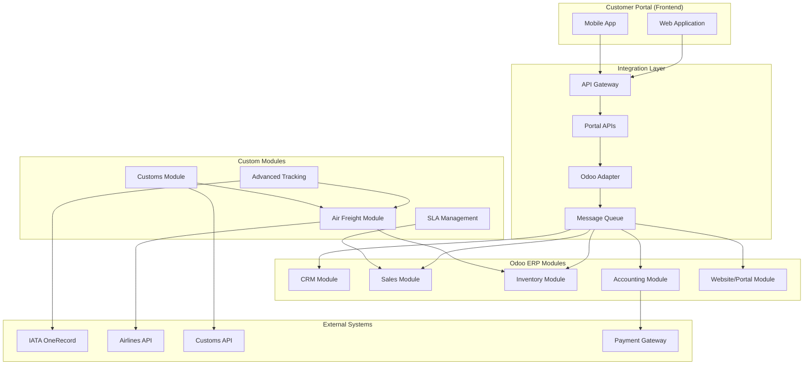

# Odoo ERP Fit & Gap Analysis

## Executive Summary

This document analyzes the compatibility between ALSC Customer Online Portal requirements and Odoo ERP capabilities, identifying areas where Odoo modules align with our needs (FIT) and areas requiring customization or alternative solutions (GAP).

## Analysis Overview

| Module Category | Fit Score | Gap Score | Recommendation |
|----------------|-----------|-----------|----------------|
| CRM & Customer Management | 85% | 15% | Use with minor customizations |
| Sales Management | 90% | 10% | Direct implementation |
| Inventory & Logistics | 70% | 30% | Significant customization needed |
| Accounting & Invoicing | 95% | 5% | Direct implementation |
| Project Management | 60% | 40% | Consider alternative or heavy customization |
| Website & Portal | 75% | 25% | Use as foundation with custom development |

**Overall Assessment**: Odoo provides a strong foundation for 75% of requirements with customization needed for logistics-specific features.

## Detailed Module Analysis

### 1. CRM & Customer Management

#### Odoo CRM Module Capabilities (FIT)

✅ **Customer/Partner Management**
- Complete customer profiles with contacts
- Customer categorization and segmentation
- Lead to customer conversion workflow
- Customer hierarchy management
- Document attachment system

✅ **Communication Management**
- Email integration and tracking
- Activity scheduling and follow-ups
- Communication history logging
- Mass mailing capabilities

✅ **Sales Pipeline**
- Opportunity management
- Pipeline visualization
- Automated workflows
- Sales team management

#### Portal Requirements vs Odoo CRM

| Requirement | Odoo Capability | Fit | Gap | Solution |
|-------------|-----------------|-----|-----|----------|
| Customer registration | Lead/Partner creation | ✅ | - | Direct mapping |
| Approval workflow | Partner validation | ✅ | Minor | Add approval states |
| Customer tiers (Premium/Standard) | Partner categories | ✅ | - | Use category system |
| Credit limit management | Partner credit limit | ✅ | - | Built-in feature |
| Multi-contact management | Partner contacts | ✅ | - | Built-in feature |
| Document management | Attachment system | ✅ | - | Built-in feature |
| Customer analytics | CRM reports | ✅ | Minor | Custom dashboards |

#### Customization Requirements (GAP)

🔶 **Minor Customizations Needed**
- Add logistics-specific customer fields (IATA codes, bonded warehouse licenses)
- Custom approval workflow for customer registration
- Integration with external customer validation services
- Portal-specific customer dashboard

**Estimated Development**: 2-3 weeks

### 2. Sales Management

#### Odoo Sales Module Capabilities (FIT)

✅ **Quote & Order Management**
- Online quotation system
- Order confirmation workflow
- Multi-currency support
- Price list management
- Delivery terms configuration

✅ **Product & Service Catalog**
- Product variants and configurations
- Service products for logistics
- Pricing rules and discounts
- Unit of measure management

✅ **Integration Capabilities**
- Website integration
- Inventory integration
- Accounting integration
- CRM integration

#### Portal Requirements vs Odoo Sales

| Requirement | Odoo Capability | Fit | Gap | Solution |
|-------------|-----------------|-----|-----|----------|
| Service request to quote | Quote creation | ✅ | - | Direct workflow |
| Multi-service bundling | Product bundling | ✅ | - | Built-in feature |
| Dynamic pricing | Pricelist rules | ✅ | - | Configuration |
| Approval workflows | Sale approval | ✅ | - | Built-in workflow |
| Customer portal access | Online quotes | ✅ | - | Built-in portal |
| Service templates | Product templates | ✅ | Minor | Custom templates |
| Integration with tracking | Custom fields | ✅ | Minor | Add tracking fields |

#### Customization Requirements (GAP)

🔶 **Minor Customizations Needed**
- Logistics service product templates
- AWB number generation integration
- Shipment milestone tracking in sales orders
- Custom pricing rules for logistics services

**Estimated Development**: 1-2 weeks

### 3. Inventory & Logistics Management

#### Odoo Inventory Module Capabilities (FIT)

✅ **Basic Inventory Management**
- Multi-warehouse support
- Stock movements and transfers
- Inventory valuation methods
- Barcode support

✅ **Shipping & Receiving**
- Delivery orders
- Shipping methods
- Tracking number management
- Batch picking and packing

⚠️ **Limited Logistics Features**
- Basic warehouse operations
- Simple delivery tracking
- Limited air freight features
- No IATA compliance

#### Portal Requirements vs Odoo Inventory

| Requirement | Odoo Capability | Fit | Gap | Solution |
|-------------|-----------------|-----|-----|----------|
| AWB management | Product tracking | ⚠️ | Major | Custom AWB module |
| Flight manifest | Delivery planning | ⚠️ | Major | Custom flight module |
| Customs clearance | Inventory moves | ❌ | Critical | Third-party integration |
| Real-time tracking | Delivery tracking | ⚠️ | Major | IATA OneRecord integration |
| Cargo consolidation | Batch operations | ⚠️ | Moderate | Custom logic |
| Weight/dimension calc | Product attributes | ✅ | Minor | Configuration |
| Multi-piece shipments | Stock moves | ✅ | Minor | Custom fields |

#### Critical Customizations Required (GAP)

❌ **Major Development Needed**

1. **Air Freight Management Module**
   - AWB number generation and validation
   - Flight scheduling and capacity management
   - Cargo manifest generation
   - IATA compliance features

2. **Customs Integration Module**
   - Customs declaration management
   - Regulatory compliance tracking
   - Document generation for customs
   - Integration with customs APIs

3. **Advanced Tracking Module**
   - IATA OneRecord integration
   - Real-time milestone tracking
   - Exception handling and alerts
   - Multi-carrier tracking aggregation

**Estimated Development**: 8-12 weeks

### 4. Accounting & Invoicing

#### Odoo Accounting Module Capabilities (FIT)

✅ **Complete Accounting System**
- Multi-currency accounting
- Automated invoice generation
- Payment processing
- Tax management
- Financial reporting

✅ **Integration Features**
- Sales order to invoice workflow
- Inventory cost integration
- CRM integration
- Bank reconciliation

#### Portal Requirements vs Odoo Accounting

| Requirement | Odoo Capability | Fit | Gap | Solution |
|-------------|-----------------|-----|-----|----------|
| Automated invoicing | Invoice automation | ✅ | - | Built-in feature |
| Multi-currency billing | Multi-currency | ✅ | - | Built-in feature |
| Payment gateway integration | Payment providers | ✅ | - | Standard connectors |
| Credit note management | Credit notes | ✅ | - | Built-in feature |
| Recurring billing | Recurring invoices | ✅ | - | Built-in feature |
| Customer payment portal | Online payment | ✅ | - | Built-in portal |
| Financial reporting | Standard reports | ✅ | Minor | Custom logistics reports |

#### Customization Requirements (GAP)

🔶 **Minor Customizations Needed**
- Logistics-specific invoice templates
- Custom payment terms for air freight
- Integration with specialized payment gateways
- Freight cost calculation automation

**Estimated Development**: 1 week

### 5. Project Management

#### Odoo Project Module Capabilities (FIT)

✅ **Basic Project Management**
- Task management and assignment
- Time tracking
- Project templates
- Gantt charts and kanban boards

⚠️ **Limited Service Request Features**
- Basic task workflows
- Simple approval processes
- Limited customization options

#### Portal Requirements vs Odoo Project

| Requirement | Odoo Capability | Fit | Gap | Solution |
|-------------|-----------------|-----|-----|----------|
| Service request tracking | Task management | ⚠️ | Moderate | Custom workflow |
| SLA management | Project deadlines | ⚠️ | Moderate | Custom SLA module |
| Automated assignments | Task assignment | ✅ | Minor | Configuration |
| Status notifications | Activity notifications | ✅ | Minor | Custom templates |
| Customer visibility | Portal access | ⚠️ | Moderate | Custom portal views |
| Approval workflows | Project stages | ⚠️ | Moderate | Custom workflow |

#### Alternative Recommendation (GAP)

❌ **Consider Custom Service Request Module**
- Dedicated service request management
- Logistics-specific workflows
- Advanced SLA tracking
- Customer portal integration
- Integration with shipping modules

**Estimated Development**: 4-6 weeks

### 6. Website & Customer Portal

#### Odoo Website Module Capabilities (FIT)

✅ **Portal Infrastructure**
- Customer portal framework
- User authentication system
- Document sharing
- Basic self-service features

✅ **Website Features**
- CMS capabilities
- Form builders
- Mobile responsive
- SEO optimization

#### Portal Requirements vs Odoo Website

| Requirement | Odoo Capability | Fit | Gap | Solution |
|-------------|-----------------|-----|-----|----------|
| Customer registration | Portal signup | ✅ | - | Built-in feature |
| Document upload | File uploads | ✅ | - | Built-in feature |
| Service request forms | Website forms | ✅ | Minor | Custom forms |
| Tracking interface | Portal views | ⚠️ | Moderate | Custom tracking views |
| Payment processing | eCommerce | ✅ | Minor | Adapt for services |
| Mobile app support | PWA support | ⚠️ | Moderate | Custom mobile app |
| Multi-language | Website i18n | ✅ | - | Built-in feature |

#### Customization Requirements (GAP)

🔶 **Moderate Customizations Needed**
- Custom portal dashboard for logistics
- Advanced tracking interface
- Mobile-first responsive design
- Integration with external systems
- OCR document processing interface

**Estimated Development**: 4-6 weeks

## Integration Architecture with Odoo

### Recommended Integration Pattern

### Data Synchronization Strategy

#### Real-time Sync (Immediate)
- Customer registration/updates
- Service request creation
- Payment processing
- Critical status updates

#### Batch Sync (Scheduled)
- Analytics data
- Reporting data
- Document archival
- Audit logs

#### Event-driven Sync (Triggered)
- Shipment milestones
- SLA breaches
- Exception handling
- Notifications

## Implementation Roadmap

### Phase 1: Core Odoo Setup (4 weeks)
- Install and configure base Odoo modules
- Setup CRM, Sales, Accounting modules
- Configure basic customer portal
- Setup development and testing environments

### Phase 2: Basic Integration (6 weeks)
- Develop Odoo API adapter
- Implement customer synchronization
- Setup service request to sales order workflow
- Configure basic portal interface

### Phase 3: Logistics Customization (8 weeks)
- Develop air freight management module
- Implement AWB number generation
- Create flight scheduling interface
- Setup customs clearance workflow

### Phase 4: Advanced Features (6 weeks)
- Implement IATA OneRecord integration
- Develop real-time tracking system
- Setup advanced analytics
- Mobile app development

### Phase 5: Testing & Deployment (4 weeks)
- Integration testing
- User acceptance testing
- Performance optimization
- Production deployment

**Total Estimated Timeline**: 28 weeks (7 months)

## Cost-Benefit Analysis

### Odoo Licensing Costs
| Component | Users | Annual Cost (USD) |
|-----------|-------|-------------------|
| Odoo Enterprise | 50 users | $37,500 |
| Additional modules | - | $5,000 |
| Support & maintenance | - | $10,000 |
| **Total Annual** | - | **$52,500** |

### Custom Development Costs
| Component | Weeks | Cost (USD) |
|-----------|-------|------------|
| Core integration | 10 | $100,000 |
| Logistics modules | 12 | $120,000 |
| Portal customization | 6 | $60,000 |
| Testing & deployment | 4 | $40,000 |
| **Total Development** | 32 | **$320,000** |

### Alternative Solution Comparison
| Approach | Initial Cost | Annual Cost | Pros | Cons |
|----------|--------------|-------------|------|------|
| **Odoo + Custom** | $320,000 | $52,500 | Integrated ERP, proven platform | High customization needed |
| **Custom Portal + SAP** | $500,000 | $150,000 | Enterprise grade | Very expensive |
| **SaaS Logistics Platform** | $50,000 | $120,000 | Quick deployment | Limited customization |
| **Full Custom Solution** | $800,000 | $80,000 | Complete control | High risk, long timeline |

## Risk Assessment

### Technical Risks
| Risk | Probability | Impact | Mitigation |
|------|-------------|---------|------------|
| Odoo upgrade compatibility | Medium | High | Version control, testing |
| Performance with customizations | Medium | Medium | Load testing, optimization |
| Integration complexity | High | Medium | Phased approach, prototyping |
| Data migration issues | Low | High | Thorough testing, backup plan |

### Business Risks
| Risk | Probability | Impact | Mitigation |
|------|-------------|---------|------------|
| User adoption challenges | Medium | High | Training, change management |
| Feature gaps discovered late | Medium | Medium | Proof of concept, prototyping |
| Vendor lock-in | Low | Medium | API abstraction layer |
| Regulatory compliance issues | Low | High | Regular compliance reviews |

## Recommendations

### Primary Recommendation: Hybrid Approach
1. **Use Odoo as ERP backbone** for CRM, Sales, Accounting
2. **Develop custom logistics modules** for air freight specifics
3. **Create portal API layer** for flexibility and future-proofing
4. **Implement gradual migration** to minimize business disruption

### Key Success Factors
- **Executive sponsorship** for change management
- **Dedicated project team** with Odoo and logistics expertise
- **Phased implementation** to validate approach
- **Comprehensive testing** at each phase
- **User training program** for adoption

### Alternative Considerations
- **If budget is constrained**: Start with Odoo Community + basic customizations
- **If timeline is critical**: Consider SaaS logistics platform initially
- **If control is paramount**: Full custom development with API-first architecture

---

**Conclusion**: Odoo provides a solid foundation for 75% of requirements with significant value in ERP integration. The remaining 25% requires substantial custom development, particularly for logistics-specific features. The hybrid approach offers the best balance of functionality, cost, and time-to-market.

**Next Steps**: 
1. Proof-of-concept development for critical logistics features
2. Detailed technical architecture design
3. Project team formation and resource planning
4. Stakeholder approval for recommended approach